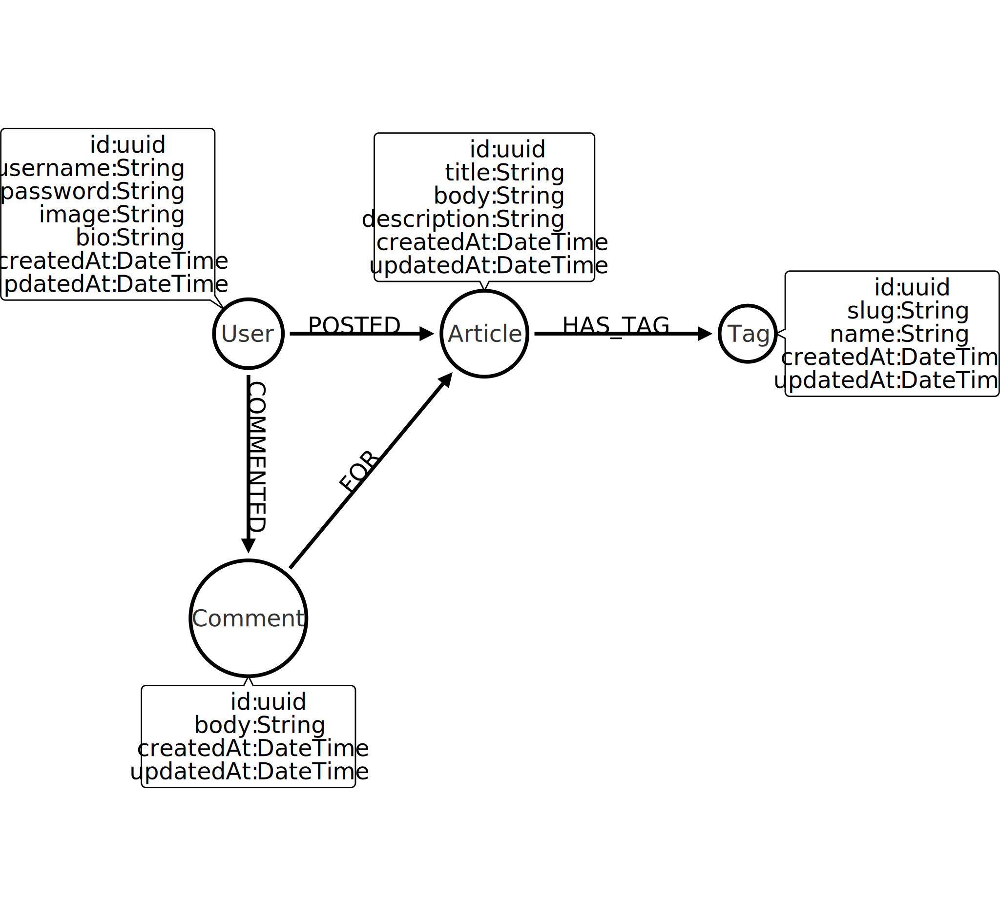

# 

> ### Neo4j & Typescript (using Nest.js) codebase containing real world examples (CRUD, auth, advanced patterns, etc) that adheres to the [RealWorld](https://github.com/gothinkster/realworld) spec and API.


This codebase was created to demonstrate a fully fledged fullstack application built with a **Neo4j** database backed [Nest.js](https://nestjs.com) application including CRUD operations, authentication, routing, pagination, and more.

We've gone to great lengths to adhere to the [Neo4j](https://neo4j.com) and [Nest.js](https://nestjs.com)  community styleguides & best practices.

For more information on how to this works with other frontends/backends, head over to the [RealWorld](https://github.com/gothinkster/realworld) repo.


# How it works

Neo4j is a [Graph Database](https://neo4j.com/developer/graph-database/), a database designed to hold the connections between data (known as relationships) as important as the data itself.  A Neo4j database consists of Nodes connected together with Relationships.  Both nodes and relationships can contain one or more properties, which are key/value pairs.

For more information on how Neo4j compares to other databases, you can check the following links:

* [RDBMS to Graph](https://neo4j.com/developer/graph-db-vs-rdbms/)
* [NoSQL to Graph](https://neo4j.com/developer/graph-db-vs-nosql/)


## Data Model



The data model diagram has been created with [Arrow](http://www.apcjones.com/arrows/).  You can edit the model by clicking the **Export Markup** button in Arrows, copying the contents of [arrows.html](model/arrows.html) into the text box and clicking **Save** at the bottom of the modal.

## Dependencies

* [nest-neo4j](https://github.com/adam-cowley/nest-neo4j) - A module that provides functionality for interacting with a Neo4j Database inside a Nest.js application.
* **Authentication** is provided by the `passport`, `passport-jwt` and `passport-local` packages.  For more information on how this was implemented, check out the [Authenticating Users in Nest.js with Neo4j ](https://www.youtube.com/watch?v=Y7125-Tb2jE&list=PL9Hl4pk2FsvX-Y5-phtnqY4hJaWeocOkq&index=3) video on the Neo4j Youtube Channel.

## Modules, Controllers, Services

The application contains two modules.  Modules are a way to group functionality (think domains and subdomains in DDD) and a convenient way to register functionality with the main app.  These modules are registered in the [AppModule](./src/app.module.ts).

* [**user**](/src/user) - This module provides functionality based around User nodes.  This includes user profiles, follow/unfollow functionality and all authentication functionality.
* [**article**](/src/article) - All functionality based around Article and Tag nodes


## Validation Errors

Validation errors are returned with the HTTP 400 Bad Request.  The [UnprocessibleEntityValidationPipe](./src/pipes/unprocessible-entity-validation.pipe.ts) extends Nest.js's out-of-the-box `ValidationPipe`, providing an `exceptionFactory` function that instead returns an `UnprocessableEntityException` error containing the error messages required by the UI.


# Further Reading

This example was built as part of a series of Live Streams on the [Neo4j Twitch Channel](https://twitch.tv/neo4j_).  You can watch the videos back on the [Building Applications with Neo4j and Typescript playlist](https://www.youtube.com/c/neo4j/playlists) on the [Neo4j Youtube Channel].


# Getting started

## Installation

```bash
$ npm install
```

## Running the app

```bash
# development
$ npm run start

# watch mode
$ npm run start:dev

# production mode
$ npm run start:prod
```

## Test

```bash
# unit tests
$ npm run test

# e2e tests
$ npm run test:e2e

# test coverage
$ npm run test:cov
```


# Questions, Comments, Support

If you have any questions or comments, please feel free to reach out on the [Neo4j Community Forum](https://community.neo4j.com) or create an Issue.  If you spot any bugs or missing features, feel free to submit a Pull Request.